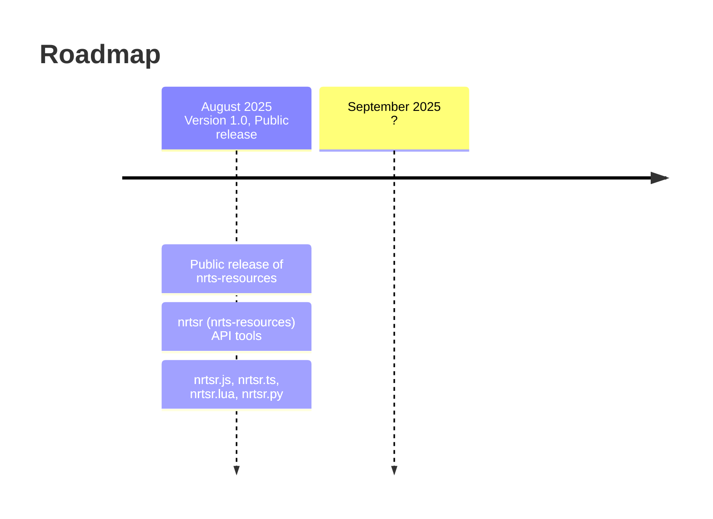

---
# the default layout is 'page'
icon: fas fa-info-circle
order: 4
mermaid: true
---

> If you have not seen the main website yet, go to [https://nrts-resources.onrender.com](https://nrts-resources.onrender.com/)
{: .prompt-info }

> If are just here to see the lastest release and update log for my prebuilt libraries, you can ignore this page.
{: .prompt-tip }

Nrts-resources-public is a blog containing my developement journey with nrts-resources, starting from version 1.0.

I'll try to write to it often each day I make changes to the website. Hopefully through this blog you can learn about me and more about how to make your own projects!

